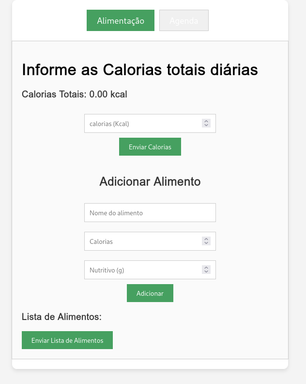
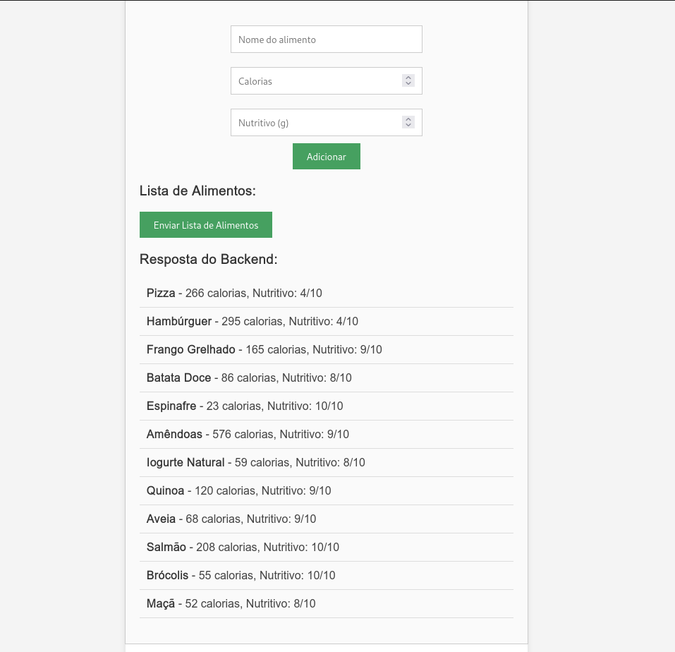
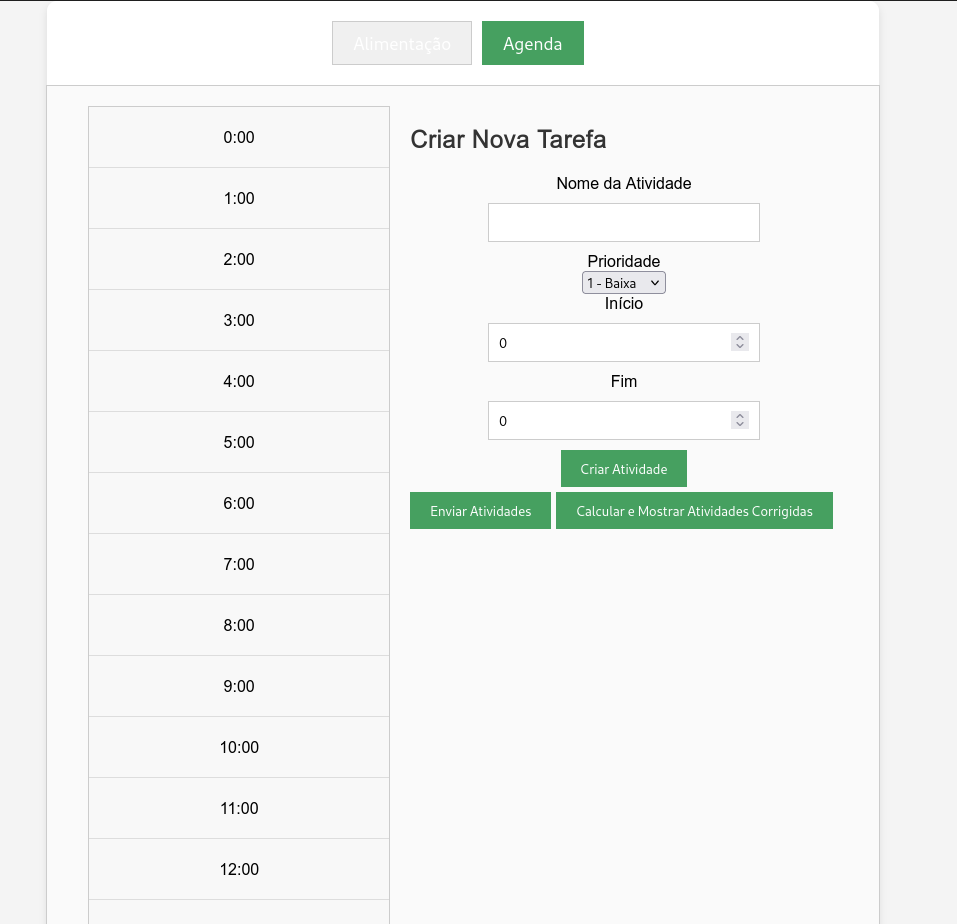
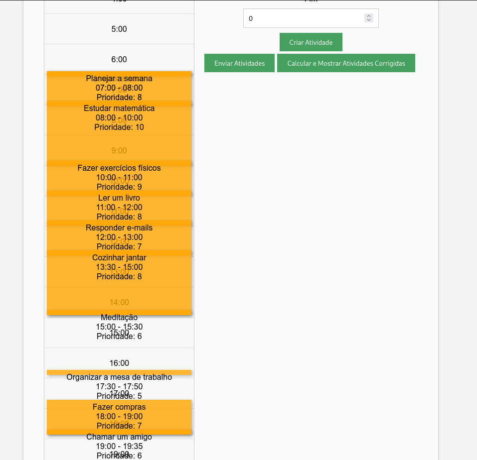

# Projeto Carnaval

**Número da Lista**: 18<br>
**Conteúdo da Disciplina**: Programação Dinâmica<br>

## Alunos
|Matrícula | Aluno |
| -- | -- |
| 22/1022248  | Carlos Eduardo Mota Alves |
| 22/1021993  | Hugo Queiroz Camelo de Melo |

## Sobre 
O Projeto Carnaval nasceu da necessidade de equilibrar saúde e bem-estar com a correria do dia a dia. Com as férias se aproximando, criamos essa plataforma para ajudar as pessoas a organizar suas rotinas, manter uma alimentação saudável e se preparar para curtir seus dias da melhor forma possível.

Nosso objetivo é oferecer ferramentas que facilitam a criação de planos alimentares, sugestões de atividades físicas e um planejamento eficiente para que você alcance seus objetivos sem estresse. Seja para adotar hábitos mais saudáveis ou simplesmente organizar melhor seu tempo, o Projeto Carnaval está aqui para te ajudar a brilhar!

## Screenshots









## Instalação 
**Linguagem**: Python, Javascript<br>
**Framework**: Flask e React<br>

## Pré-requisitos

### Backend
Para executar o backend do projeto, é necessário ter **Python** instalado (versão recomendada: >= 3.8) e instalar algumas bibliotecas.

#### Passo a Passo

1. **Crie um ambiente virtual (recomendado):**

   ```bash
   python3 -m venv .venv  # Cria um ambiente virtual chamado .venv
   source .venv/bin/activate  # Ativa o ambiente virtual (Linux/macOS)
   .venv\Scripts\activate  # Ativa o ambiente virtual (Windows)

2. **Navegue** até a pasta do backend, onde os algoritmos foram implementados.

3. **Instale as bibliotecas** necessárias executando o seguinte comando:

   ```bash
   pip install -r requirements.txt

### Frontend
Para executar o Frontend do projeto, é necessário ter **Node.js** instalado e instalar o **Npm**.

#### Passo a Passo
1. **Navegue** até a pasta do ```frontend/mazerunner```.
2. **Instale as depedêcias** necessárias executando o seguinte comando:

   ```bash
   npm install

## Uso 

## Pré-requisitos
Para utilizar o projeto, é necessário que todas as dependências estejam instaladas e configuradas, conforme descrito na seção de **Instalação**.

## Passo a Passo para Uso

1. **Inicie o Backend**
   - Com as dependências já instaladas, execute o seguinte comando para iniciar o servidor backend:
     
     ```bash
     python server.py
     ```

   - Isso iniciará o servidor Flask e manterá o backend ativo, (em `http://127.0.0.1:5000`).

2. **Inicie o Frontend**
   - Com o servidor backend em execução, abra um novo terminal e navegue até a pasta do frontend, `frontFit/`.
   - Certifique-se de instalar as dependências do frontend (caso ainda não tenha feito), executando:
     
     ```bash
     npm install
     ```

   - Após instalar as dependências, inicie o frontend com o comando:
     
     ```bash
     npm run dev
     ```

   - Esse comando abrirá automaticamente o frontend no navegador (geralmente em `http://localhost:5173/`), onde será possível interagir com o gerador e solucionador de labirintos.

